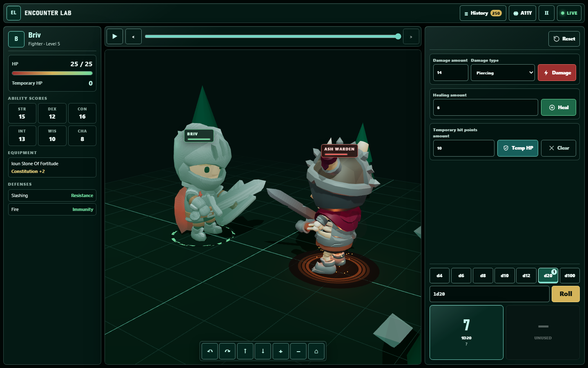

# Encounter Lab

Encounter Lab implements the Briv hit-point API challenge and the full-stack
frontend addendum as a server-authoritative combat-state sample.

#TL;DR.
see [TLDR_5_Minute_Review.md](TLDR_5_Minute_Review.md)

The backend owns combat truth: HP, temporary HP, healing, resistance,
immunity, dice outcomes, command versioning, event sequence, and
persistence. The React frontend sends player intent and renders committed
backend state — it never computes an outcome itself.



Briv's current/max HP, temporary HP, stats, defenses, equipment, and
committed combat history on the left; damage/heal/temp-HP controls and
server-rolled dice on the right; the 3D battlefield in the center.

## Quick start

```bash
docker compose up --build
```

Then open:

- Web: `http://localhost:5173`
- API: `http://localhost:5000/graphql`

For local development without Docker, see [`RUN_LOCALLY.md`](RUN_LOCALLY.md).

## What this implements

### Backend API challenge

| Requirement | Implemented |
|---|---|
| Load Briv from `briv.json` | Yes — `FileCharacterSeed` reads the one canonical seed file |
| Deal typed damage | Yes |
| Apply resistance and immunity | Yes — odd-damage rounding tested |
| Heal without exceeding max HP | Yes |
| Add temporary HP using non-stacking rules | Yes — higher value replaces, never adds |
| Temporary HP absorbs damage first | Yes |
| Temporary HP cannot be healed | Yes |
| Persist state during application lifetime | Yes — SQLite snapshots, events, processed commands |
| Expose API operations | GraphQL query + mutations |
| Test HP rules | Domain + API tests |

### Frontend addendum

| Requirement | Implemented |
|---|---|
| React + TypeScript | Yes |
| CSS Modules | Yes |
| Show name/class/level | Yes |
| Show current/max HP | Yes |
| Show temporary HP | Yes |
| Show stats | Yes |
| Damage/heal/temp HP controls | Yes |
| UI updates after API changes | SignalR committed-event sync + snapshot reconciliation |
| Large and small screens | Responsive layout |
| Keyboard and screen-reader support | Labels, semantic controls, live regions, focus handling |

This table exists so a reviewer can confirm the assignment was done, not
just skimmed — every row maps to a real file below, not a claim.

## Reviewer path

Start here for a fast code review.

| Area | Files |
|---|---|
| Briv seed loading | `src/EncounterLab.Api/Data/briv.json`, `src/EncounterLab.Infrastructure/FileCharacterSeed.cs` |
| HP rules | `src/EncounterLab.Domain/Combat/HitPointPool.cs` |
| Character state transitions | `src/EncounterLab.Domain/Combat/CharacterState.cs` |
| Dice rules | `src/EncounterLab.Domain/Combat/DiceExpression.cs` |
| Application command handling | `src/EncounterLab.Application/CombatService.cs` |
| Persistence and idempotency | `src/EncounterLab.Infrastructure/SqliteCombatStore.cs` |
| GraphQL API | `src/EncounterLab.Api/GraphQL/Query.cs`, `src/EncounterLab.Api/GraphQL/Mutation.cs` |
| Frontend API client | `src/EncounterLab.Web/src/api/graphql.ts` |
| Frontend state/retry/reconciliation | `src/EncounterLab.Web/src/state/useEncounterController.ts`, `src/EncounterLab.Web/src/state/encounterMerge.ts` |
| Briv UI controls | `src/EncounterLab.Web/src/components/CharacterPanel.tsx`, `src/EncounterLab.Web/src/components/ActionPanel.tsx` |
| Live sync | `src/EncounterLab.Api/Realtime/`, `src/EncounterLab.Web/src/api/combatHub.ts` |
| AI engineering process | `docs/ai-assurance.md`, `.ai/`, `AGENTS.md`, `.github/prompts/`, `.claude/` |

The 3D scene, dice presentation, replay timeline, and accessibility debug
tools are product extensions around the required backend/API/frontend
challenge. They do not own combat rules — `tools/architecture-check.py`
statically enforces that. See [`docs/scope.md`](docs/scope.md) for the full
required-vs-extension breakdown.

## Using the app

1. Open the web app. Briv loads from the backend seed data.
2. Use **Damage** to apply typed damage.
   - Fire is ignored — Briv has fire immunity.
   - Slashing is halved (rounded down) — Briv has slashing resistance.
   - Other damage types apply normally.
3. Use **Heal** to restore HP up to the maximum.
4. Use **Temp HP** to grant non-stacking temporary HP, or **Clear** to zero
   it out explicitly.
5. Roll dice (server-authoritative — the result comes back from the API,
   it is never generated in the browser).
6. Open the app in a second tab to watch committed backend updates sync
   live between both.
7. Scrub the history timeline to review past committed state; live
   controls disable while reviewing.

The frontend never calculates a final result. It sends a command with a
`commandId` and `expectedVersion`, and renders whatever the server commits.

## Architecture

```text
React/TypeScript frontend
  -> sends player intent through GraphQL
  -> receives committed state through GraphQL + SignalR

ASP.NET Core API (C#, Hot Chocolate GraphQL)
  -> validates commands
  -> enforces commandId + expectedVersion
  -> delegates combat rules to domain/application services

Domain layer
  -> owns HP, healing, temp HP, resistance, immunity, and dice rules

SQLite store (via EF Core)
  -> persists snapshots, event history, and processed commands
```

> The client may request an action, but only the backend may decide the
> result.

Further detail: [`docs/architecture.md`](docs/architecture.md) (full command
lifecycle and data shape), [`docs/domain-invariants.md`](docs/domain-invariants.md)
(every combat rule, precisely stated), and [`docs/history.md`](docs/history.md)
(how this codebase actually got to its current state).

## Validation

Run the full validation gate:

```bash
./tools/validate.sh
```

or on Windows:

```powershell
./tools/validate.ps1
```

Focused checks:

```bash
dotnet test
npm run test --prefix src/EncounterLab.Web
python tools/architecture-check.py
python tools/accessibility-check.py
python tools/ui-quality-check.py
```

Current validation status and exact commands are in
[`VALIDATION.md`](VALIDATION.md) — it states what was actually run, not
what should pass in principle.

## AI-assisted engineering

This repo includes AI-assisted engineering artifacts because the project
was developed with agent support under explicit guardrails, in both
Copilot/VS Code and Claude Code's native formats (`AGENTS.md`,
`.github/`, `.claude/`).

AI tools were allowed to propose implementation changes, tests, docs, and
review passes. They were not release authority — deterministic tests and
static guardrails, plus human review, gate every change.

The non-negotiable rule was server authority:

- no client-side final HP calculation
- no client-side resistance or immunity calculation
- no client-side dice outcomes
- no client-generated event sequence
- no client-generated authoritative version

`.ai/rejected/` preserves real, dated diffs of AI-generated code that
violated this rule and was caught — either by a static guardrail or by
the operator testing live — including a client-authoritative-damage patch
that was never allowed to ship. `tools/architecture-check.py` continues to
block that failure mode today.

See [`docs/ai-assurance.md`](docs/ai-assurance.md) and
[`.ai/README.md`](.ai/README.md) for the full process and how to verify it
yourself.

## Project structure

```text
src/
  EncounterLab.Domain/         combat rules (pure C#, no I/O)
  EncounterLab.Application/    command validation, idempotency, orchestration
  EncounterLab.Infrastructure/ EF Core + SQLite persistence, character seed
  EncounterLab.Api/            GraphQL API, SignalR hub
  EncounterLab.Web/            React/TypeScript frontend
    src/api/                   GraphQL + SignalR clients
    src/state/                 controller, merge/reconciliation logic
    src/components/            character panel, action panel, dice, history
    src/scene/                 3D battlefield presentation (extension, not core)
    src/accessibility/         accessibility debug lab (extension, not core)
tests/                         domain, API, and frontend test suites
tools/                         setup/dev/validate/package scripts + static guardrails
docs/                          architecture, invariants, scope, tradeoffs, history
.ai/                           AI-assisted task/run/rejected provenance log
.github/, .claude/             AI agent instructions/prompts (Copilot + Claude Code)
```

## Tradeoffs and intentionally omitted work

This is a take-home implementation, not a production game service.

Intentionally omitted:

- authentication and authorization
- multi-character encounter ownership
- production observability
- a distributed cache/message bus
- deployment hardening beyond `docker compose up`
- a full D&D rules engine, campaign builder, or asset marketplace

The current implementation focuses on the challenge requirements: Briv's
HP rules, backend authority, API behavior, the frontend addendum,
accessibility, testing, and a reviewable AI-assisted engineering process.
Full reasoning for each omission — what was picked, what wasn't, and why —
is in [`docs/tradeoffs.md`](docs/tradeoffs.md).
